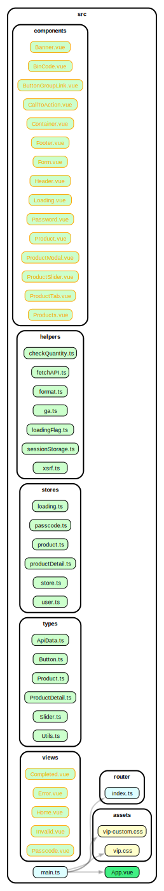

# ec-vip-vue 隱形賣場

## Tech Stack

| **Package** | **Version** |
| ----------- | ----------- |
| Node.js     | v18.16.0    |
| yarn        | v1.22.21    |
| TypeScript  | v4.8.4      |
| Vue         | v3.2.41     |
| Vue Router  | v4.1.5      |
| Pinia       | v2.0.23     |
| Vite        | v3.1.8      |
| Vitest      | v0.34.6     |

## Screenshots

### 首頁 Index


### Product detail Modal


### 權限驗證 Passcode


## How I use it?

### STEP1: Swagger and local API Setup

```sh
yarn install
yarn run api
```

API address:
`http://localhost:3000/${api path}`

### STEP2: Project Setup

```sh
yarn run dev
```

Run the Project and access at:

- `http://localhost:5173/activity/活動代號`
- `http://localhost:5173/passcode/活動代號`

### Type-Check, Lint with [ESLint](https://eslint.org/)

```sh
yarn run type-check
yarn run format
yarn run lint
```

### Run Unit Tests with [Vitest](https://vitest.dev/)

```sh
yarn run test:unit
yarn run test:coverage
yarn run test:ui
```

### Run dependency cruiser

```shell
yarn add -D dependency-cruiser
npx depcruise --init
# src > no > yes > tsconfig.json > yes
npx depcruise src --include-only "^src" --output-type dot | dot -T svg > dependency-graph.svg
```


